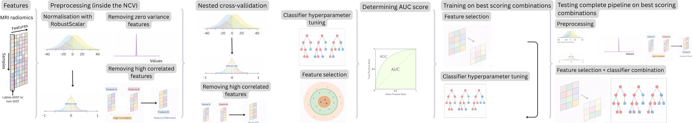

# Project_ML_TM10011
Groep 18
Bergenhenegouwen, Kool, Mobach, Planje  

________________________________________________________

Dear reader,

To fully comprehend the model selection and training pipeline, we recommend a thorough reading of the paper: Classifying GIST and non-GIST cells in CT using a radiomics-based Machine Learning approach by Bergenhenegouwen, Kool, Mobach, and Planje.

The pipeline processes radiomic features from CT scans to distinguish between GIST and non-GIST cells. The workflow includes data splitting (80/20), preprocessing, feature selection, and evaluation via nested cross-validation. The top three performing models are hyperparameter-tuned, trained on the full training set, and finally validated on the test set using DeLong’s statistical analysis.

### Python Scripts
* **`load_data.py`**: Loads and explores the `GIST_radiomicFeatures.csv` dataset.
* **`preprocessing.py`**: Performs normalization, zero-variance feature removal, and high-correlation removal.
* **Feature Selection**:
    * `fs_lasso.py`: LASSO-based feature selection.
    * `fs_mutualinformation.py`: Mutual Information-based selection.
    * `fs_RFE.py`: Recursive Feature Elimination.
    * `fs_mRMR.py`: Minimum Redundancy Maximum Relevance selection.
* **Model Selection & Tuning**:
    * `nested_cv_RF.py`, `nested_cv_SVM.py`, `nested_cv_XGB.py`: Nested cross-validation loops to evaluate feature selection and hyperparameter combinations with the classifier.
    * `training_RF.py`, `training_XGB.py`: Tunes hyperparameters for the top 3 models, trains on the 100% training set, and generates learning and validation curves.
* **Evaluation**:
    * `wilcoxon_test.py`: Statistical comparison of nested CV results to identify the top 3 models.
    * `final_test.py`: Final evaluation on the test set, DeLong’s statistical analysis and ROC curve plotting.

### Data & Results
* **`model_scores_ncv/`**: Contains scores from the nested cross-validation process.
* **`models/`**: Top 3 trained models.
* **`images/`**: Saved plots of ROC -, validation - and learning curves.

### Creating environment
conda create -n tm10011 python=3.11
conda activate tm10011

pip install -r requirements.txt

